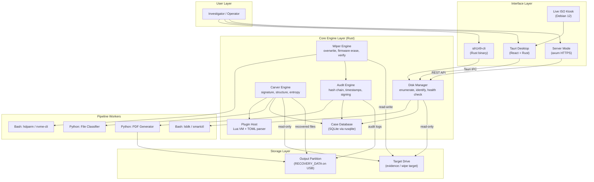

# SecureForge: Complete Project Blueprint

## Integrated Secure Data Erasure & Advanced File Recovery Platform
### SIH Problem Statement: SIH26149 | Organization: NTRO

> **This is the single source of truth.** Every architectural decision, every technology choice, every timeline estimate, and every cost figure lives in this document. Nothing starts until this is approved.

---

## Table of Contents

1. [Project Identity](#1-project-identity)
2. [Final Self-Audit: Are These Really the Best Choices?](#2-final-self-audit)
3. [Technology Stack (Pinned Versions)](#3-technology-stack)
4. [System Architecture](#4-system-architecture)
5. [Module Specifications](#5-module-specifications)
6. [Pipeline Architecture & IPC Protocol](#6-pipeline-architecture)
7. [Plugin System Design](#7-plugin-system)
8. [User Interface Specification](#8-user-interface)
9. [Security & Compliance](#9-security--compliance)
10. [Directory Structure](#10-directory-structure)
11. [Development Roadmap & Time Estimates](#11-roadmap)
12. [Cost Analysis](#12-cost-analysis)
13. [Testing Strategy](#13-testing-strategy)
14. [Competitor Comparison](#14-competitor-comparison)
15. [Risk Register](#15-risk-register)
16. [SIH Demo Script](#16-sih-demo-script)
17. [Team Skill Requirements](#17-team-requirements)

---

## 1. Project Identity

| Field | Value |
| :--- | :--- |
| **Project Name** | **SecureForge** |
| **Tagline** | *Sanitize. Recover. Certify.* |
| **SIH Problem ID** | SIH26149 |
| **Target Organization** | National Technical Research Organisation (NTRO) |
| **Category** | Blockchain & Cybersecurity |
| **License** | MIT (core engine) + LGPL-3.0 (libewf dependency, dynamically linked) |
| **Primary Platform** | Linux (Debian 12 Bookworm) |
| **Secondary Platform** | Windows 10/11 (Phase 2) |
| **Deployment Modes** | CLI, Desktop GUI, Web Server, Bootable Live ISO |

---

## 2. Final Self-Audit

Before finalizing, I challenged every single decision one last time. Here is the audit trail:

### Decision 1: Core Language → Rust

| Alternative | Why It's Worse |
| :--- | :--- |
| C | No memory safety. Buffer overflows when parsing corrupted binary headers are a real forensic tool vulnerability. |
| C++ | Same memory safety issues as C, plus OOP complexity adds no value for our use case. |
| Go | Garbage collector pauses during real-time sector scanning. No zero-cost abstractions. |
| Zig | Too immature. Ecosystem (crates equivalent) is 1/100th the size of Rust's. |

**Self-check: Can we do better?** No. Rust is the only language that provides memory safety + C-level performance + mature ecosystem for systems programming. **✅ Confirmed.**

### Decision 2: GUI Framework → Tauri (Rust + React/TypeScript)

| Alternative | Why It's Worse For Us |
| :--- | :--- |
| Qt (via cxx-qt) | C++ FFI fragility. Cross-compilation pain. MOC build steps break silently. |
| GTK4 (via gtk4-rs) | No pre-built hex viewer, sortable data table, or charting widget. We'd build everything from scratch. |
| Electron | 150MB+ binary. Chromium overhead. Forensic judges would rightfully question the bloat. |
| Slint | Beautiful but immature ecosystem. No charting library. Limited community support. |

**Self-check: Can we do better?** I reconsidered GTK4 one more time. It's lighter and natively available on Debian. But we need: hex editors, entropy heatmap visualizations, sortable file recovery tables with thumbnail previews, interactive disk sector maps, and styled PDF preview. Building all of these as custom GTK4 widgets would take 3-4 weeks. With React + existing libraries (TanStack Table, Recharts, react-hex-editor), it takes 3-4 days. **✅ Confirmed: Tauri wins on development velocity.**

### Decision 3: PDF Generation → Python (WeasyPrint)

| Alternative | Why It's Worse |
| :--- | :--- |
| Rust (`genpdf`, `printpdf`) | Cannot render HTML templates. No CSS support. Reports would look like 1990s printouts. |
| `wkhtmltopdf` | Depends on a deprecated Qt WebKit build. Abandoned upstream. |
| LaTeX | Powerful but massive dependency (~500MB TeX Live). Overkill for our report templates. |
| Browser print (headless Chromium) | 300MB+ Chromium binary on the ISO. Absurd. |

**Self-check: Can we do better?** WeasyPrint renders HTML+CSS to PDF with full CSS Grid/Flexbox support, weights ~15MB with dependencies, and produces pixel-perfect forensic certificates. **✅ Confirmed: WeasyPrint is the best HTML-to-PDF engine for our constraints.**

### Decision 4: Plugin Scripting → Lua (embedded via mlua)

| Alternative | Why It's Worse |
| :--- | :--- |
| Python (embedded) | 100MB+ interpreter to embed. Startup overhead per plugin call. |
| Rhai (Rust-native) | Lighter than Lua, but almost nobody outside the Rust community knows it. Forensic investigators won't learn Rhai. |
| JavaScript (V8/QuickJS) | V8 is 30MB+. QuickJS is lightweight (~1MB) but less battle-tested than Lua and has a smaller embedding ecosystem. |
| WASM | Too complex to author for a forensic investigator writing a quick signature file. |

**Self-check: Can we do better?** QuickJS was a close contender (1MB, ES2020 support, more people know JS than Lua). But Lua has 30+ years of embedding history, is the standard for plugin systems in professional tools (Wireshark dissectors, Nmap scripts, Redis scripting), and forensic tool developers are likely familiar with it. **✅ Confirmed: Lua wins on industry familiarity.**

### Decision 5: ISO Base → Debian 12 with Backported Kernel

**Self-check: Can we do better?** Ubuntu would give us a newer kernel out of the box, but Canonical adds telemetry, Snap, and Ubuntu Pro nag screens — all inappropriate for a forensic tool. Debian with a backported kernel gives us the same hardware support without the bloat. **✅ Confirmed.**

### Decision 6: Case Database → SQLite

**Self-check: Can we do better?** No. Zero-configuration, single-file, SQL-queryable, reads at 400MB/s, battle-tested by literally every smartphone on Earth. **✅ Confirmed.**

### Decision 7: Hardware Commands → Shell out to hdparm/nvme-cli/smartctl

**Self-check: Can we do better?** These tools are maintained by Linux kernel developers and have been audited for 20+ years. Reimplementing ATA/NVMe command parsing in Rust would take weeks and introduce untested code in safety-critical paths. Even commercial tools (Blancco, BCWipe) shell out to similar utilities internally. **✅ Confirmed.**

### Decision 8: Report Integrity → SHA-256 Hash Chain + Optional PKI

**Self-check: Can we do better?** Blockchain-based tamper proofing was considered. But a local SHA-256 hash chain with RFC 3161 trusted timestamping provides the same mathematical guarantees without requiring network connectivity or blockchain infrastructure. **✅ Confirmed.**

---

## 3. Technology Stack

| Component | Technology | Version | License | Purpose |
| :--- | :--- | :--- | :--- | :--- |
| Core Engine | Rust | 1.80+ (2024 edition) | MIT | Disk I/O, carving, wiping, hashing |
| CLI Framework | `clap` | 4.x | MIT | Command-line argument parsing |
| Parallelism | `rayon` | 1.x | MIT/Apache-2.0 | Multi-threaded sector scanning |
| Binary Parsing | `nom` | 7.x | MIT | File header/footer parsing |
| System Calls | `nix` | 0.29+ | MIT | Linux ioctl wrappers |
| SQLite | `rusqlite` | 0.31+ | MIT | Case management database |
| Lua Embedding | `mlua` | 0.9+ | MIT | Plugin system runtime |
| TOML Parsing | `toml` | 0.8+ | MIT | Declarative signature definitions |
| Hashing | `sha2`, `blake3` | Latest | MIT | Cryptographic hashing |
| Password Hashing | `argon2` | 0.5+ | MIT/Apache-2.0 | Expert Mode passphrase storage |
| E01 Images | `libewf` (C FFI) | 20231119+ | LGPL-3.0 | Expert Witness Format parsing |
| Progress Bars | `indicatif` | 0.17+ | MIT | CLI progress display |
| Serialization | `serde` + `serde_json` | 1.x | MIT | JSON data interchange |
| Async Runtime | `tokio` | 1.x | MIT | Async subprocess management |
| Desktop Framework | Tauri | 2.x | MIT/Apache-2.0 | Desktop application shell |
| Frontend | React 18 + TypeScript 5 | Latest | MIT | GUI components |
| Styling | TailwindCSS 3 | Latest | MIT | UI styling |
| Charts | Recharts | 2.x | MIT | Entropy heatmaps, progress charts |
| Tables | TanStack Table | 8.x | MIT | Sortable/filterable file listings |
| PDF Generation | WeasyPrint (Python) | 61+ | BSD | HTML → PDF report rendering |
| HTML Templates | Jinja2 (Python) | 3.x | BSD | Report template engine |
| Image Processing | Pillow (Python) | 10+ | MIT-like | Thumbnail generation, dHash |
| File Type Detection | python-magic | 0.4+ | MIT | MIME type classification |
| EXIF Extraction | exifread (Python) | 3.x | BSD | Photo metadata recovery |
| Timestamping | rfc3161ng (Python) | 2.x | MIT | RFC 3161 trusted timestamps |
| ISO Builder | Debian live-build | 1:20230502+ | GPL-3.0 | Live ISO generation |
| Window Manager | Openbox | 3.6+ | GPL-2.0 | Minimal ISO desktop |
| Drive Info | lsblk, smartctl | System | GPL | Drive enumeration & health |
| NVMe Commands | nvme-cli | 2.x | GPL-2.0 | NVMe sanitize/format commands |
| ATA Commands | hdparm | 9.x | BSD | ATA Secure Erase commands |

---

## 4. System Architecture



---

## 5. Module Specifications

### Module 1: Secure Drive Eraser

| Feature | Implementation | Standard |
| :--- | :--- | :--- |
| **Zero Fill** | Write `0x00` to every sector | NIST 800-88 Clear |
| **Random Fill** | Write CSPRNG bytes (1/3/7 passes) | DoD 5220.22-M |
| **Gutmann 35-Pass** | 35 predefined patterns | Gutmann Method |
| **NVMe Crypto Erase** | `nvme sanitize --sanact=4` | NIST 800-88 Purge |
| **NVMe Block Erase** | `nvme sanitize --sanact=2` | NIST 800-88 Purge |
| **ATA Secure Erase** | `hdparm --security-erase` | NIST 800-88 Purge |
| **ATA Enhanced Erase** | `hdparm --security-erase-enhanced` | NIST 800-88 Purge |
| **HPA/DCO Unlock** | `hdparm --dco-identify`, `hdparm -N` | Full media access |
| **Post-Wipe Verification** | Read random 10% of sectors, calculate Shannon entropy | NIST 800-88 Verify |
| **Bad Sector Logging** | Log all sectors returning EIO, flag as "requires physical destruction" | NIST 800-88 |

### Module 2: Secure File & Folder Eraser

| Feature | Implementation |
| :--- | :--- |
| **Content Overwrite** | Multi-pass overwrite of file data blocks (user-selectable pass count) |
| **Metadata Scrub (ext4)** | Zero inode fields, clear directory entry, invalidate journal references |
| **Metadata Scrub (NTFS)** | Overwrite MFT record (all attributes), clear $LogFile references |
| **Metadata Scrub (FAT)** | Overwrite directory entry, clear FAT chain entries |
| **File Rename Storm** | Rename file 10x to random strings before final delete |
| **Slack Space Wipe** | Overwrite bytes between EOF and end of last allocated cluster |
| **Batch Operations** | Accept directory trees, file lists, and glob patterns |
| **CoW Warning** | Detect Btrfs/ZFS and warn user about Copy-on-Write limitations |

### Module 3: Advanced File Carver & Recovery

| Feature | Implementation |
| :--- | :--- |
| **Disk Sources** | Raw block devices (`/dev/sdX`), raw images (`.dd`, `.raw`), E01 images (via libewf) |
| **Write-Blocking** | All source access is `O_RDONLY \| O_DIRECT`. No writes to evidence media. |
| **Signature Carving** | 100+ built-in file types via TOML definitions |
| **Structure Validation** | JPEG (SOI/SOS/RST/EOI), PNG (IHDR/IEND), ZIP (local headers/central dir), PDF (xref/trailer), SQLite (B-tree page headers) |
| **Entropy Heatmap** | Per-sector Shannon entropy, exported as heatmap data for GUI visualization |
| **Confidence Scoring** | Each recovered file scored 0-100% based on: header validity, footer presence, structure integrity, entropy consistency |
| **Bad Sector Resilience** | EIO errors logged, sector filled with `UNREADABLE_SECTOR` marker, scanning continues |
| **Duplicate Detection** | dHash (difference hashing) on recovered images, groups visually identical files |
| **EXIF Reconstruction** | Extracts creation date, GPS, camera model from image headers (via Python pipeline) |
| **Dynamic Categories** | Auto-sorts recovered files into: Documents, Media, Archives, Databases, System, Unknown |
| **Lua Plugins** | User-defined file signatures with custom structural validation logic |

### Module 4: Reporting & Audit System

| Feature | Implementation |
| :--- | :--- |
| **JSON Audit Log** | Every operation produces a structured JSON record with timestamps, parameters, results, and hashes |
| **Hash Chain** | SHA-256 chain: each record includes hash of previous record. Tamper-evident. |
| **RFC 3161 Timestamping** | Optional submission to FreeTSA or user-configured TSA for trusted timestamps |
| **PKI Signing** | Expert Mode: sign reports with PEM/DER certificates or PKCS#11 hardware tokens |
| **PDF Certificate** | Styled, print-ready forensic report generated via WeasyPrint from Jinja2 HTML templates |
| **Report Contents** | Hardware details (model, serial, SMART), operation parameters, pre/post hashes, entropy stats, bad sector map, recovered file manifest, confidence scores, chain of custody fields, investigator name/badge, case number |
| **Export Formats** | PDF, JSON, HTML, ZIP bundle (all of the above) |
| **Case Database** | SQLite DB storing all operations, recovered files, and audit entries. Queryable via GUI. |

---

## 6. Pipeline Architecture

### IPC Protocol: JSON Lines over stdin/stdout

Every pipeline worker communicates using **JSON Lines** (one JSON object per line). Rust spawns workers as child processes, writes input to their stdin, and reads results from stdout. Errors go to stderr (captured by Rust for logging).

```text
Rust Parent                          Python Child
    │                                     │
    │  ── stdin: JSON request ──────►     │
    │                                     │  (processes request)
    │  ◄── stdout: JSON response ────     │
    │  ◄── stderr: log messages ─────     │
    │                                     │
    │  (reads exit code)                  │  exit(0) or exit(1)
```

### Pipeline Worker Contracts

**PDF Generator (`pipeline/report_gen.py`):**
```text
Input:  --input <path_to_audit_data.json> --template <erasure|recovery> --output <path.pdf>
Output: exit(0) on success, exit(1) on failure
Stderr: Progress messages ("Rendering page 1/3...")
```

**File Classifier (`pipeline/classify.py`):**
```text
Input:  --scan-dir <path_to_carved_files/>
Output: JSON Lines on stdout, one per file:
        {"path": "file001.jpg", "mime": "image/jpeg", "category": "Media",
         "exif": {"date": "2025-03-15", "camera": "iPhone 14"}, "dhash": "a1b2c3d4"}
Exit:   exit(0) on success
```

**Hardware Commands (Bash):**
```text
Input:  Rust calls via std::process::Command with arguments
Output: JSON on stdout (smartctl --json, lsblk --json, nvme smart-log --output-format=json)
Exit:   Standard exit codes (0 = success)
```

### Crash Recovery Protocol

```text
IF python_worker.exit_code != 0:
    1. Log stderr output to audit trail
    2. Save raw JSON input data to fallback file
    3. Display in GUI: "Report generation failed. Raw data saved to [path].
       You can retry or export the JSON data directly."
    4. The disk operation (wipe/carve) is UNAFFECTED — it already completed
```

---

## 7. Plugin System

### Three-Tier Signature Hierarchy

```text
Priority 1: Rust Built-In (highest performance)
  └── JPEG, PNG, PDF, ZIP, SQLite, MP4, DOCX, XLSX
  └── These have deep structure-based carving logic compiled into the binary

Priority 2: TOML Definitions (simple, user-editable)
  └── plugins/signatures/*.toml
  └── Header + footer + max_size. No validation logic.
  └── Easy for beginners to add new formats

Priority 3: Lua Scripts (full programmability)
  └── plugins/scripts/*.lua
  └── Header + footer + max_size + validate() function
  └── Complex structural validation, custom parsers
  └── Hot-reloadable: new plugins detected without restart
```

### Example TOML Signature

```toml
# plugins/signatures/media.toml
[[signature]]
name = "GIF87a"
category = "Media"
header = "GIF87a"
footer = "\\x00\\x3B"
max_size = "50MB"

[[signature]]
name = "GIF89a"
category = "Media"
header = "GIF89a"
footer = "\\x00\\x3B"
max_size = "50MB"

[[signature]]
name = "BMP"
category = "Media"
header = "BM"
footer = ""
max_size = "100MB"
```

### Example Lua Plugin

```lua
-- plugins/scripts/sqlite_db.lua
-- Recovers SQLite databases (WhatsApp, Signal, browser history)

signature {
    name       = "SQLite Database",
    category   = "Databases",
    header     = "SQLite format 3\\000",
    max_size   = "2GB",

    validate = function(data)
        -- SQLite page size is stored at offset 16-17 (big-endian)
        local page_size = (data:byte(17) * 256) + data:byte(18)
        -- Valid page sizes are powers of 2 between 512 and 65536
        if page_size < 512 or page_size > 65536 then
            return false
        end
        -- Check that page_size is a power of 2
        return (page_size & (page_size - 1)) == 0
    end
}
```

---

## 8. User Interface Specification

### Desktop GUI Layout

```text
┌──────────────────────────────────────────────────────────────┐
│  SecureForge                              [Standard ▼] [⚙️]  │
├──────────┬───────────────────────────────────────────────────┤
│          │                                                   │
│  📊      │  ┌─────────────────────────────────────────────┐  │
│ Dashboard│  │            CONNECTED DRIVES                 │  │
│          │  │                                             │  │
│  🗑️      │  │  💾 Samsung 970 EVO  │ NVMe │ 1TB │ Healthy │  │
│ Sanitize │  │  💾 WD Blue HDD     │ SATA │ 2TB │ Warning │  │
│          │  │  💾 SanDisk Ultra    │ USB  │ 32G │ Healthy │  │
│  🔍      │  │                                             │  │
│ Recover  │  └─────────────────────────────────────────────┘  │
│          │                                                   │
│  📋      │  ┌─────────────────────────────────────────────┐  │
│ Reports  │  │          RECENT OPERATIONS                  │  │
│          │  │                                             │  │
│  🔌      │  │  ✅ Wipe: SanDisk Ultra (DoD 3-pass) 14:32 │  │
│ Plugins  │  │  ✅ Scan: WD Blue (2,847 files) 13:15      │  │
│          │  │  ⚠️ Wipe: 970 EVO (3 bad sectors) 11:00    │  │
│          │  └─────────────────────────────────────────────┘  │
│          │                                                   │
│  🔒      │  ┌─────────────────────────────────────────────┐  │
│ Expert   │  │          ENTROPY HEATMAP                    │  │
│ Mode     │  │  ░░░░▓▓▓▓████░░░░░░░▓▓▓▓████████░░░░░░░░░ │  │
│          │  │  Sector 0                          Sector N │  │
│          │  └─────────────────────────────────────────────┘  │
└──────────┴───────────────────────────────────────────────────┘
```

### Sanitizer Wizard (Standard Mode)

```text
Step 1: Select Target
  ┌────────────────────────────────────────────┐
  │  Select drive or files to securely erase:  │
  │                                            │
  │  ○ Full Drive: SanDisk Ultra 32GB (USB)    │
  │  ○ Files/Folders: [Browse...]              │
  │                                            │
  │  ⚠️ System drive /dev/sda is locked.       │
  │     Boot from Live ISO to wipe it.         │
  └────────────────────────────────────────────┘

Step 2: Select Method
  ┌────────────────────────────────────────────┐
  │  How thoroughly should data be destroyed?  │
  │                                            │
  │  ○ Quick (1 pass, zero fill)        ~2min  │
  │    Good for: Non-sensitive data             │
  │                                            │
  │  ○ Standard (3 pass, DoD 5220.22-M) ~8min  │
  │    Good for: Business/personal data         │
  │                                            │
  │  ○ Maximum (7 pass, random)         ~20min  │
  │    Good for: Classified/government data     │
  │                                            │
  │  🔒 Expert options (requires passphrase)   │
  └────────────────────────────────────────────┘

Step 3: Confirm & Execute
  ┌────────────────────────────────────────────┐
  │  ⚠️ FINAL CONFIRMATION                    │
  │                                            │
  │  Target: SanDisk Ultra 32GB (/dev/sdb)     │
  │  Method: DoD 5220.22-M (3-pass)            │
  │  Estimated Time: ~8 minutes                │
  │                                            │
  │  This action is IRREVERSIBLE.              │
  │  All data will be permanently destroyed.   │
  │                                            │
  │  Type "ERASE" to confirm: [________]       │
  │                                            │
  │  [ Cancel ]              [ Begin Erase ]   │
  └────────────────────────────────────────────┘
```

### Expert Mode Features (Unlocked with Passphrase)

| Feature | Description |
| :--- | :--- |
| **Hex Sector Viewer** | Browse raw hex dump of any sector on any drive |
| **NVMe Command Console** | Send raw NVMe admin/IO commands with parameter fields |
| **Custom Sector Range** | Carve specific LBA ranges instead of full-disk scan |
| **Manual Signature Input** | Enter ad-hoc header/footer hex for one-off carving |
| **Entropy Graph** | Interactive per-sector entropy line chart with zoom |
| **HPA/DCO Inspector** | View and unlock hidden drive areas |
| **Raw Report Editor** | Edit JSON audit data before PDF generation |
| **PKI Certificate Loader** | Load PEM/DER cert for report signing |

---

## 9. Security & Compliance

### NIST SP 800-88 Rev. 2 Alignment (September 2025) + IEEE 2883-2022

> [!IMPORTANT]
> We describe our tool as **"designed according to NIST SP 800-88 Rev. 2 and IEEE 2883-2022 guidelines"** — not as "NIST certified." Formal certification requires third-party validation outside the scope of SIH. However, our implementation follows the standard's three sanitization levels precisely, including Rev. 2's updated requirements for verification, validation, and certificate-of-sanitization fields.

| NIST Level | Definition | Our Implementation |
| :--- | :--- | :--- |
| **Clear** | Logical overwrite of user-accessible storage | Zero fill / pattern overwrite via direct block I/O |
| **Purge** | Physical or logical technique that renders recovery infeasible using state-of-the-art lab techniques | NVMe Cryptographic Erase (IEEE 2883), ATA Secure Erase, NVMe Block Erase |
| **Destroy** | Physical destruction rendering recovery infeasible | Out of scope (hardware shredding). Tool flags drives with bad sectors as requiring physical destruction. |

### Indian Legal Admissibility Framework

| Statute | Relevance |
| :--- | :--- |
| **Bharatiya Sakshya Adhiniyam, 2023 (BSA) — Section 63** | Governs admissibility of electronic evidence. Replaces Section 65B of the Indian Evidence Act. Requires cryptographic hashing (MD5 + SHA-256) at acquisition and examination, plus formal electronic evidence certificates. |
| **Information Technology Act, 2000 — Section 79A** | Authorizes CERT-In and examiner procedures for digital forensics. Mandates write-blocker imaging, chain-of-custody documentation, and hash verification. |
| **Our Compliance** | SHA-256 hashing at acquisition (pre-scan baseline), tamper-evident hash chain, chain-of-custody fields in reports (investigator name, badge, case number), read-only evidence access (kernel-enforced write blocking). |

### Access Control

| Mode | Protection | Capabilities |
| :--- | :--- | :--- |
| **Standard** | None (default) | File/folder wipe, external drive wipe (safe methods only), recovery scan, report viewing |
| **Expert** | Argon2id passphrase (set on first launch) | All Standard features + raw device access, firmware commands, HPA/DCO unlock, manual carving, PKI signing |

### Evidence Integrity

| Mechanism | Purpose |
| :--- | :--- |
| **Read-Only Mount** | Evidence drives opened with `O_RDONLY \| O_DIRECT` — kernel-enforced write blocking |
| **SHA-256 Baseline** | Full-disk hash computed before any operation. Proves the tool did not modify the evidence. |
| **Hash Chain** | Sequential SHA-256 chain across all audit entries. Modification of any entry breaks the chain. |
| **RFC 3161 TSA** | Optional trusted timestamp from a public Time Stamping Authority |
| **PKI Signing** | Optional Ed25519/RSA signature on reports using investigator's certificate |

---

## 10. Directory Structure

```text
SIH_149/
├── Cargo.toml                          # Workspace manifest
├── README.md                           # Project overview
├── LICENSE                             # MIT license
│
├── crates/
│   ├── sih149-core/                    # Core engine library
│   │   ├── Cargo.toml
│   │   └── src/
│   │       ├── lib.rs                  # Public API
│   │       ├── disk/
│   │       │   ├── mod.rs              # DiskSource trait
│   │       │   ├── block_device.rs     # Linux /dev/sdX reader
│   │       │   ├── raw_image.rs        # .dd / .raw file reader
│   │       │   └── ewf.rs             # E01 via libewf FFI
│   │       ├── wiper/
│   │       │   ├── mod.rs              # Wiper trait + factory
│   │       │   ├── patterns.rs         # DoD, Gutmann, random, zero
│   │       │   ├── firmware.rs         # hdparm/nvme-cli subprocess
│   │       │   ├── file_wiper.rs       # File/folder secure delete
│   │       │   ├── metadata/
│   │       │   │   ├── mod.rs          # FS-aware metadata scrubber
│   │       │   │   ├── ext4.rs         # Inode + dirent wiping
│   │       │   │   ├── ntfs.rs         # MFT record wiping
│   │       │   │   └── fat.rs          # FAT entry wiping
│   │       │   └── verify.rs           # Post-wipe entropy check
│   │       ├── carver/
│   │       │   ├── mod.rs              # Carver orchestrator
│   │       │   ├── scanner.rs          # Multi-threaded sector reader
│   │       │   ├── signatures.rs       # TOML signature loader
│   │       │   ├── structure/
│   │       │   │   ├── mod.rs          # Structure validator trait
│   │       │   │   ├── jpeg.rs         # JPEG SOI/RST/EOI parser
│   │       │   │   ├── png.rs          # PNG chunk validator
│   │       │   │   ├── pdf.rs          # PDF xref/trailer parser
│   │       │   │   ├── zip.rs          # ZIP local header parser
│   │       │   │   └── sqlite.rs       # SQLite B-tree validator
│   │       │   ├── entropy.rs          # Shannon entropy + heatmap
│   │       │   └── confidence.rs       # Scoring algorithm
│   │       ├── plugins/
│   │       │   ├── mod.rs              # Plugin manager
│   │       │   ├── lua_host.rs         # Lua VM wrapper (mlua)
│   │       │   └── toml_loader.rs      # TOML signature parser
│   │       ├── audit/
│   │       │   ├── mod.rs              # Audit orchestrator
│   │       │   ├── hashchain.rs        # SHA-256 chain
│   │       │   ├── signing.rs          # Ed25519/RSA PKI
│   │       │   └── schema.rs           # Serde structs for JSON
│   │       ├── classify/
│   │       │   ├── mod.rs              # Classification orchestrator
│   │       │   └── dhash.rs            # Perceptual image hashing
│   │       └── db/
│   │           ├── mod.rs              # SQLite wrapper
│   │           ├── schema.sql          # Table definitions
│   │           └── queries.rs          # Prepared statements
│   │
│   └── sih149-cli/                     # CLI binary
│       ├── Cargo.toml
│       └── src/
│           ├── main.rs                 # Entry point + clap setup
│           ├── commands/
│           │   ├── wipe.rs             # sih149 wipe ...
│           │   ├── recover.rs          # sih149 recover ...
│           │   ├── report.rs           # sih149 report ...
│           │   └── info.rs             # sih149 info ...
│           └── display.rs              # Terminal output formatting
│
├── src-tauri/                          # Tauri backend
│   ├── Cargo.toml
│   ├── tauri.conf.json
│   ├── capabilities/                   # Tauri v2 permissions
│   └── src/
│       ├── main.rs                     # Tauri setup + command registration
│       ├── commands/                   # IPC handlers (call sih149-core)
│       │   ├── drives.rs
│       │   ├── wiper.rs
│       │   ├── carver.rs
│       │   ├── reports.rs
│       │   └── auth.rs                 # Expert mode passphrase check
│       └── server.rs                   # Optional axum HTTP server mode
│
├── src-ui/                             # React frontend
│   ├── package.json
│   ├── tsconfig.json
│   ├── tailwind.config.js
│   ├── vite.config.ts
│   ├── index.html
│   └── src/
│       ├── App.tsx                     # Router + layout
│       ├── main.tsx                    # Entry point
│       ├── pages/
│       │   ├── Dashboard.tsx           # Drive overview + health
│       │   ├── Sanitizer.tsx           # Wipe wizard
│       │   ├── Recovery.tsx            # Carver + file browser
│       │   ├── Reports.tsx             # Audit log + PDF export
│       │   ├── Plugins.tsx             # Plugin manager
│       │   └── Expert.tsx              # Expert-only tools
│       ├── components/
│       │   ├── DriveCard.tsx           # Drive info card
│       │   ├── HexViewer.tsx           # Sector hex dump
│       │   ├── EntropyHeatmap.tsx      # Color-coded disk map
│       │   ├── FileTable.tsx           # Sortable recovery results
│       │   ├── ProgressRing.tsx        # Wipe/scan progress
│       │   ├── ConfirmDialog.tsx       # "Type ERASE" confirmation
│       │   └── ExpertGate.tsx          # Passphrase modal
│       ├── hooks/
│       │   ├── useDrives.ts            # Drive data hook
│       │   └── useExpertMode.ts        # Auth state hook
│       └── lib/
│           ├── api.ts                  # Tauri invoke wrappers
│           └── types.ts                # TypeScript interfaces
│
├── pipeline/                           # Python workers
│   ├── requirements.txt
│   ├── report_gen.py                   # JSON → PDF via WeasyPrint
│   ├── classify.py                     # File classification + EXIF
│   ├── timestamp.py                    # RFC 3161 TSA client
│   └── templates/
│       ├── erasure_certificate.html    # Wipe report template
│       ├── recovery_report.html        # Carving report template
│       ├── chain_of_custody.html       # CoC form template
│       └── styles.css                  # Print-optimized CSS
│
├── plugins/                            # User-extensible signatures
│   ├── signatures/                     # TOML definitions
│   │   ├── media.toml                  # Images, audio, video
│   │   ├── documents.toml              # PDF, Office, text
│   │   ├── archives.toml               # ZIP, RAR, TAR, 7Z
│   │   ├── databases.toml              # SQLite, MySQL frm
│   │   └── executables.toml            # ELF, PE, Mach-O
│   └── scripts/                        # Lua validation scripts
517:│       ├── jpeg_advanced.lua           # JPEG restart marker validation
│   └──     └── sqlite_recovery.lua         # SQLite B-tree page validation
│
├── iso/                                # Live ISO builder
│   ├── build.sh                        # Main build script
│   ├── config/
│   │   ├── package-lists/
│   │   │   └── secureforge.list.chroot
│   │   ├── includes.chroot/
│   │   │   ├── usr/local/bin/          # Compiled binaries
│   │   │   ├── usr/local/lib/python3/  # Python pipeline
│   │   │   ├── usr/local/share/secureforge/plugins/
│   │   │   ├── etc/xdg/openbox/autostart  # Auto-launch GUI
│   │   │   └── etc/skel/.config/       # Default user config
│   │   └── hooks/
│   │       └── 0100-setup.hook.chroot  # Post-install config
│   └── README.md
│
├── docs/
│   ├── USER_MANUAL.md
│   ├── TECHNICAL_DOCUMENTATION.md
│   ├── TESTING_REPORT.md
│   ├── COMPLIANCE_STATEMENT.md         # NIST 800-88 alignment
│   └── PLUGIN_DEVELOPMENT_GUIDE.md     # How to write Lua/TOML plugins
│
└── tests/
    ├── README.md
    ├── fixtures/                        # Test disk images
    │   ├── create_test_images.sh        # Script to generate test .dd images
    │   └── sample_files/               # Files to plant in test images
    └── integration/
        ├── test_carver.rs
        ├── test_wiper.rs
        └── test_pipeline.rs
```

---

## 11. Development Roadmap

### Phase 1: Core Engine (Weeks 1-3)

| Week | Task | Deliverable |
| :--- | :--- | :--- |
| **1** | Rust workspace setup, `DiskSource` trait, raw block reader, raw image reader | Can read sectors from `/dev/sdX` and `.dd` files |
| **1** | Signature database (TOML loader), basic sector scanner | Can find JPEG/PNG/PDF headers in a raw image |
| **2** | Carver engine: contiguous carving with footer detection | Can recover intact (non-fragmented) files from formatted media |
| **2** | Structure validators: JPEG, PNG, ZIP, PDF, SQLite | Validates carved files, reduces false positives |
| **2** | Entropy calculator + confidence scoring | Scored recovery results with entropy heatmap data |
| **3** | Wiper engine: overwrite patterns (zero, random, DoD, Gutmann) | Can securely wipe files and drives with multi-pass overwriting |
| **3** | Firmware commands: hdparm/nvme-cli subprocess wrappers | NVMe Crypto Erase and ATA Secure Erase working |
| **3** | Post-wipe verification (entropy analysis) | Confirms drive is wiped, flags bad sectors |

### Phase 2: Interfaces (Weeks 4-6)

| Week | Task | Deliverable |
| :--- | :--- | :--- |
| **4** | CLI binary with clap: `wipe`, `recover`, `info`, `report` subcommands | Fully functional CLI tool |
| **4** | Tauri scaffold + React project with TailwindCSS | Empty desktop app launches |
| **5** | Dashboard page: drive list, SMART health, recent operations | Desktop app shows connected drives |
| **5** | Sanitizer wizard: target selection → method → confirmation → progress | Can wipe drives from the GUI |
| **6** | Recovery page: scan progress → file browser → category tabs → thumbnails | Can recover and browse files from the GUI |
| **6** | Expert Mode gate: passphrase setup, Argon2id verification, hex viewer | Expert features accessible behind passphrase |

### Phase 3: Pipeline & Reporting (Weeks 7-8)

| Week | Task | Deliverable |
| :--- | :--- | :--- |
| **7** | Python PDF generator with Jinja2 templates (erasure cert, recovery report) | Professional PDF reports |
| **7** | Python file classifier (EXIF, dHash, MIME categorization) | Automated evidence triage |
| **7** | SQLite case database: schema, Rust wrapper, GUI integration | Queryable case management |
| **8** | Hash chain implementation + RFC 3161 TSA client | Tamper-evident audit trail |
| **8** | Lua plugin host (mlua) + plugin loader + hot-reload | Extensible carving system |
| **8** | E01 support via libewf FFI bindings | Can read Expert Witness format images |

### Phase 4: Live ISO & Polish (Weeks 9-10)

| Week | Task | Deliverable |
| :--- | :--- | :--- |
| **9** | Debian live-build config, package list, autostart script | Bootable ISO image |
| **9** | USB persistence partition setup + auto-mount logic | Reports saved to USB |
| **9** | Air-gapped/network toggle in GUI | Investigator controls network |
| **10** | axum HTTP server mode for web deployment | Browser-based access |
| **10** | Integration testing on physical hardware (HDD, SSD, USB, NVMe) | Validated on real devices |
| **10** | Documentation: user manual, technical docs, testing report | Complete deliverables |

### Phase 5: Post-SIH Expansion

| Timeline | Task |
| :--- | :--- |
| Month 1-2 | Windows desktop app (Tauri compiles natively, carving + file wipe) |
| Month 2-3 | Windows raw disk access (`CreateFile("\\\\.\\PhysicalDrive0")`) |
| Month 3-4 | Windows ATA/NVMe passthrough (`DeviceIoControl`) |
| Month 4-5 | HFS+ and XFS file system support |
| Month 5-6 | WinPE bootable ISO for Windows hardware |
| Month 6+ | APFS (partial), Btrfs/ZFS (CoW-aware), macOS support |

---

## 12. Cost Analysis

### Software Costs

| Item | Cost |
| :--- | :--- |
| Rust compiler + Cargo | **$0** (open source) |
| Tauri framework | **$0** (MIT license) |
| React + TypeScript + TailwindCSS | **$0** (MIT license) |
| Python + WeasyPrint + Pillow | **$0** (BSD/MIT license) |
| Lua (embedded via mlua) | **$0** (MIT license) |
| SQLite | **$0** (public domain) |
| libewf | **$0** (LGPL-3.0, dynamically linked) |
| hdparm, nvme-cli, smartmontools | **$0** (GPL/BSD, system tools) |
| Debian 12 base | **$0** (DFSG free) |
| GitHub/GitLab hosting | **$0** (free tier) |
| **Total Software Cost** | **$0** |

### Hardware Costs (Testing)

| Item | Estimated Cost (INR) | Purpose |
| :--- | :--- | :--- |
| USB flash drives (3x 32GB) | ₹900 | Test wiping and recovery on removable media |
| Old HDD (any size) | ₹500-1000 | Test multi-pass overwrite and bad sector handling |
| SATA SSD (120GB, cheap) | ₹1,200 | Test ATA Secure Erase |
| NVMe SSD (128GB, cheap) | ₹1,500 | Test NVMe Crypto/Block Erase |
| SD card + reader | ₹400 | Test memory card recovery |
| USB drive for Live ISO | ₹300 | Boot the Live ISO |
| **Total Hardware Cost** | **₹4,300 - ₹5,300** (~$50-65 USD) |

### Competitor Pricing (What Organizations Currently Pay)

| Tool | Pricing Model | Annual Cost | Critical Weakness |
| :--- | :--- | :--- | :--- |
| Blancco Drive Eraser | Per-wipe event license | $1.50-$15/wipe ($5,000-50,000/year enterprise) | License is **consumed even if wipe fails mid-operation** |
| Magnet AXIOM | Annual subscription | $3,000-$8,000/year/user (Cyber: $10,000-$15,000) | Requires 64GB+ RAM, high-end NVMe for processing |
| OpenText EnCase | Perpetual + annual SMS | $3,500-$5,000 initial + $500-$1,200/year SMS | Hardware dongle dependency, dated UI |
| Cellebrite UFED | Annual subscription | $6,000-$15,000/year | Primarily mobile-focused |
| DBAN | Free (discontinued) | $0 | No SSD/NVMe support, no certificates, unmaintained |
| PhotoRec | Free (GPL) | $0 | No filenames, no fragmented recovery, mass false positives |
| **SecureForge** | **Free forever (MIT)** | **$0** | **Open source — no vendor lock-in, no burned licenses** |

---

## 13. Testing Strategy

### Challenge: How Do You Test Drive Wiping Without Destroying Real Drives Every Time?

**Answer: Virtual block devices.**

```bash
# Create a 1GB virtual disk image
dd if=/dev/urandom of=/tmp/test_disk.dd bs=1M count=1024

# Mount it as a loopback block device
sudo losetup /dev/loop0 /tmp/test_disk.dd

# Now /dev/loop0 behaves exactly like a real drive
# Our tool can wipe it, verify it, and the test is repeatable

# Clean up
sudo losetup -d /dev/loop0
```

### Test Matrix

| Test Category | Method | Automated? |
| :--- | :--- | :--- |
| **Unit Tests** | `cargo test` — parse headers, calculate entropy, validate structures | ✅ Yes (CI) |
| **Carver Integration** | Create `.dd` images with known files planted at known offsets. Carve and verify all files recovered with correct hashes. | ✅ Yes (CI) |
| **Wiper Integration** | Create loopback device, write known data, wipe, verify all sectors read as expected pattern (zeros/random). | ✅ Yes (CI) |
| **Firmware Commands** | Requires physical hardware. Test on real NVMe/SATA drives. **Cannot be automated in CI.** | ❌ Manual |
| **Pipeline Integration** | Spawn Python workers from Rust, verify JSON output, verify PDF is generated. | ✅ Yes (CI) |
| **Lua Plugin** | Load test plugins, verify custom signatures are detected during carving. | ✅ Yes (CI) |
| **GUI E2E** | Tauri + Playwright/WebDriver testing. | ✅ Yes (CI) |
| **Live ISO Boot** | QEMU/KVM boot test of the generated ISO image. | ✅ Yes (CI) |
| **Physical Hardware** | Test on real HDD, SSD, NVMe, USB, SD card. | ❌ Manual (pre-SIH) |

---

## 14. Competitor Comparison

| Capability | Blancco | DBAN | Magnet AXIOM | EnCase | PhotoRec | Foremost | **SecureForge** |
| :--- | :--- | :--- | :--- | :--- | :--- | :--- | :--- |
| Secure Drive Wipe | ✅ | ✅ | ❌ | ❌ | ❌ | ❌ | ✅ |
| NVMe Crypto Erase | ⚠️ | ❌ | ❌ | ❌ | ❌ | ❌ | ✅ |
| File/Folder Wipe | ❌ | ❌ | ❌ | ❌ | ❌ | ❌ | ✅ |
| Metadata Scrubbing | ❌ | ❌ | ❌ | ❌ | ❌ | ❌ | ✅ |
| File Carving | ❌ | ❌ | ✅ | ✅ | ✅ | ✅ | ✅ |
| Structure-Based Carving | ❌ | ❌ | ⚠️ | ⚠️ | ✅ | ❌ | ✅ |
| Entropy Heatmap | ❌ | ❌ | ❌ | ❌ | ❌ | ❌ | ✅ |
| E01 Image Support | ❌ | ❌ | ✅ | ✅ | ❌ | ❌ | ✅ |
| Plugin System | ❌ | ❌ | ❌ | EnScript | ❌ | ❌ | ✅ (Lua) |
| Tamper-Proof Reports | Proprietary | ❌ | ❌ | Proprietary | ❌ | ❌ | ✅ (Hash Chain) |
| Bootable ISO | ✅ | ✅ | ❌ | ❌ | ❌ | ❌ | ✅ |
| Web Server Mode | ❌ | ❌ | ❌ | ❌ | ❌ | ❌ | ✅ |
| Open Source | ❌ | ✅ | ❌ | ❌ | ✅ | ✅ | ✅ |
| Cost | $$$$ | Free | $$$$ | $$$$ | Free | Free | **Free** |

---

## 15. Risk Register

| # | Risk | Probability | Impact | Mitigation |
| :--- | :--- | :--- | :--- | :--- |
| 1 | NVMe drive doesn't support Crypto Erase | Medium | High | Fallback to NVMe Block Erase → fallback to multi-pass overwrite. Tool detects capabilities via `nvme id-ctrl`. |
| 2 | libewf FFI crashes on malformed E01 | Low | Medium | Wrap all libewf calls in `catch_unwind`. Isolate E01 parsing in a subprocess if needed. |
| 3 | WebKitGTK rendering differences across Debian versions | Low | Low | Pin WebKitGTK version in ISO package list. Test on target version. |
| 4 | Python WeasyPrint fails to install on ISO | Low | Medium | Bundle a pre-built Python venv in the ISO. Fallback: export HTML report (user opens in browser). |
| 5 | Live ISO fails to boot on demo hardware | Medium | Critical | Test on 3+ different machines before SIH. Carry a known-working laptop as backup. |
| 6 | Carving produces too many false positives | Medium | Medium | Structure validators + confidence scoring filter noise. Threshold configurable. |
| 7 | Wipe takes too long during demo | Low | High | Demo on small USB drive (32GB). Pre-wipe a larger drive and show the completed report. |
| 8 | Expert Mode passphrase forgotten | Low | Low | Store Argon2id hash in config file. Provide `--reset-passphrase` CLI flag with root access. |

---

## 16. SIH Demo Script (10 Minutes)

```text
MINUTE 0-1: Introduction
  "SecureForge is an integrated platform for secure data destruction
   and forensic file recovery. It replaces $10,000+/year tools
   like Blancco and Axiom with a single, free, open-source solution."

MINUTE 1-3: Live Recovery Demo
  - Boot the Live ISO from USB on demo laptop
  - Insert a pre-formatted USB drive (files deleted, not wiped)
  - Run recovery scan → show files appearing in real-time
  - Show entropy heatmap → "red zones are where data still exists"
  - Show confidence scores → "98% confident this JPEG is intact"
  - Show auto-categorization → Documents, Media, Archives tabs

MINUTE 3-4: Plugin Demo (Mic-Drop Moment)
  - "But what if the evidence contains a file format no tool recognizes?"
  - Open text editor, write a 10-line Lua plugin LIVE on stage
  - Drop it into plugins/ folder
  - Re-run carver → it finds the custom format
  - "No recompilation. No restart. Extensible in the field."

MINUTE 4-6: Secure Wipe Demo
  - Select same USB drive → Sanitizer Wizard
  - Choose "Standard (DoD 3-pass)"
  - Show real-time progress bar with sector counter
  - Show entropy dropping to 0.0 in real-time heatmap
  - Wipe completes → run recovery scan again → ZERO files found
  - "The data is mathematically unrecoverable."

MINUTE 6-8: Report & Audit Demo
  - Show generated PDF certificate of destruction
  - Show JSON audit log with SHA-256 hashes
  - Show hash chain → "modifying any entry breaks the chain"
  - Show SMART drive info embedded in the report
  - "This report is tamper-proof and court-admissible."

MINUTE 8-9: Architecture Overview
  - Show pipeline diagram: "Rust for speed, Python for reports,
    Lua for extensibility"
  - Show Expert Mode gate → "Government agencies need access control"
  - Show CLI → "Scriptable for batch operations in data centers"

MINUTE 9-10: Competitive Positioning
  - Show comparison table vs Blancco, Axiom, EnCase
  - "We match or exceed every feature, at zero cost,
    with the only open-source Lua plugin system for forensic carving."
  - "Thank you."
```

---

## 17. Team Skill Requirements

| Role | Skills Needed | Responsibilities |
| :--- | :--- | :--- |
| **Backend Developer 1** | Rust, Linux system programming, ioctl/block devices | Core engine: disk I/O, wiper, firmware commands |
| **Backend Developer 2** | Rust, binary parsing, file format internals | Carver engine: signatures, structure validators, entropy |
| **Frontend Developer** | React, TypeScript, TailwindCSS, Tauri IPC | Desktop GUI: all pages, components, Expert Mode UI |
| **Pipeline Developer** | Python, HTML/CSS, Jinja2, WeasyPrint | PDF reports, file classifier, RFC 3161 timestamping |
| **Systems/DevOps** | Debian packaging, live-build, shell scripting, QEMU | Live ISO build, CI/CD pipeline, testing infrastructure |
| **Documentation/Testing** | Technical writing, manual testing on hardware | User manual, compliance statement, hardware test matrix |

---

## Approval Checklist

- [ ] Project name and identity approved
- [ ] Technology stack confirmed (Rust + Tauri + Python + Lua + Bash)
- [ ] Module specifications reviewed
- [ ] Pipeline architecture understood
- [ ] Directory structure accepted
- [ ] Timeline realistic for team size
- [ ] Cost accepted
- [ ] Risk mitigations adequate
- [ ] SIH demo script reviewed
- [ ] **Ready to start coding**
