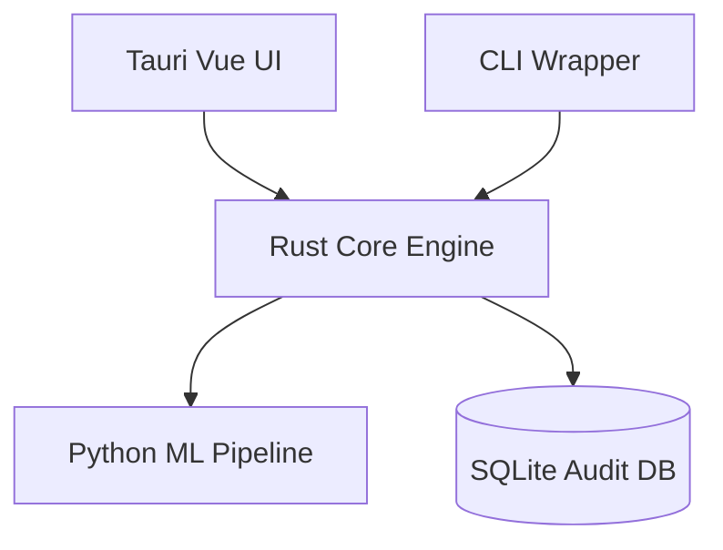

# SecureForge Technical Documentation

## 1. Architecture Overview
SecureForge employs a 4-layer architecture:
1. **User Interface (Tauri/CLI)**
2. **Core Engine (`sih149-core`, Rust)**
3. **Pipeline Workers (Python/OpenCV for analysis)**
4. **Database & Storage (SQLite, File I/O)**

