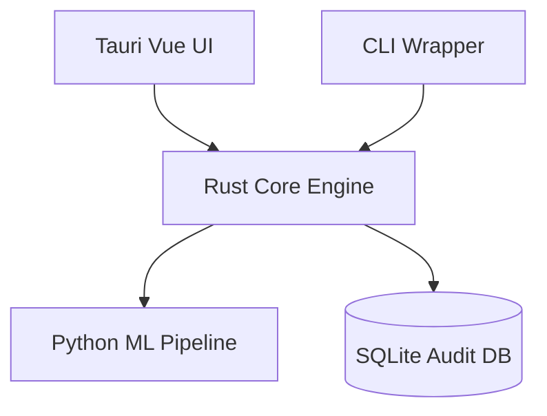

# SecureForge Technical Documentation

## 1. Architecture Overview
SecureForge employs a 4-layer architecture:
1. **User Interface (Tauri/CLI)**
2. **Core Engine (`sih149-core`, Rust)**
3. **Pipeline Workers (Python/OpenCV for analysis)**
4. **Database & Storage (SQLite, File I/O)**

## 2. Core Engine (sih149-core)
The Rust core implements rigorous safety bounds. Key components include:
- `DiskSource`: Abstraction trait for block devices and raw images.
- `WipePattern`: Trait defining PRNG streams for overwriting.
Error handling utilizes `thiserror` for descriptive, bubbled errors. Public API surface is highly documented.

## 3. Pipeline IPC Protocol
Communication between Rust and Python uses JSON Lines (JSONL) over `stdin`/`stdout`. Messages require an `id`, `method`, and `params`. Crash recovery involves Rust heartbeats monitoring Python PIDs, respawning workers automatically upon failure with clear exit codes.

## 4. Plugin System
The Carving Engine supports a 3-tier hierarchy:
1. **Rust Built-in:** Compiled, ultra-fast structural validation.
2. **TOML Signatures:** User-extensible Magic Byte definitions loaded at runtime.
3. **Lua Scripts:** Complex structural checks executed via `mlua` (hot-reloaded).

